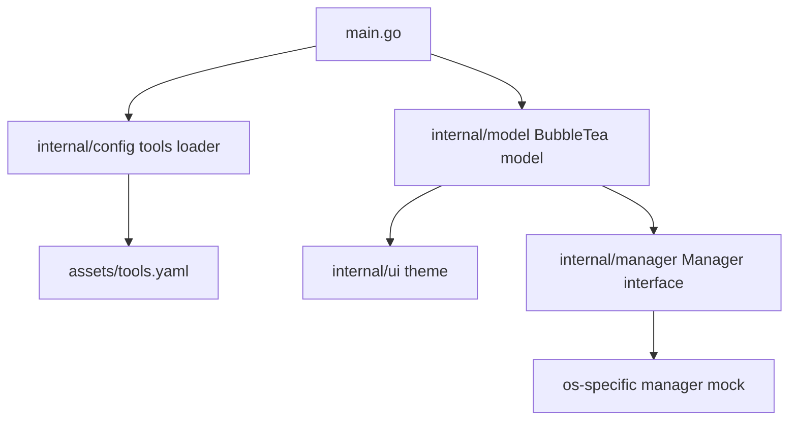

> **项目结构已演进：** 原计划的 `config-cli/` 子目录已合并为仓库根目录下的 Go 模块，模块名 `initos`；`main.go`、`internal/`、`assets/` 现位于仓库根。下文仍保留原计划的文件路径与模块名，便于对照历史方案。

# Cross-Platform Config CLI 主线计划

## 目标与边界
- 在当前仓库中新增 Go 工程目录（建议 `config-cli/`），并将其收敛为唯一配置入口。
- 历史脚本与旧实现统一视为归档内容，保留在 `old/` 目录，仅供参考，不作为执行路径。
- 交付可运行的 Bubble Tea 多选 TUI 原型：支持空格切换、回车触发（先走 mock）、关键字过滤输入。
- 建立声明式工具配置基础：`tools.yaml` + `go:embed` + 结构化解析。
- 建立跨平台包管理抽象接口（仅定义与 mock 实现），为后续 pre-flight、并行安装、自更新留接口。
- 文档与入口命令全部切到新 CLI，旧方式仅在迁移说明中保留最小引用。

## 目录与文件设计
- 新增 [`config-cli/go.mod`](config-cli/go.mod)：模块名 `config-cli`。
- 新增 [`config-cli/main.go`](config-cli/main.go)：程序入口，初始化模型并启动 Bubble Tea 主循环。
- 新增 [`config-cli/internal/model/model.go`](config-cli/internal/model/model.go)：TUI 状态机（列表、选中态、过滤词、焦点、执行态）。
- 新增 [`config-cli/internal/ui/theme.go`](config-cli/internal/ui/theme.go)：Lipgloss 样式与粉紫渐变（`#FF69B4` -> `#800080`）。
- 新增 [`config-cli/internal/config/tools.go`](config-cli/internal/config/tools.go)：`Tool` 结构、YAML schema、`go:embed` 加载与校验。
- 新增 [`config-cli/assets/tools.yaml`](config-cli/assets/tools.yaml)：声明式工具配置样例（含 windows/darwin/debian install 命令）。
- 新增 [`config-cli/internal/manager/manager.go`](config-cli/internal/manager/manager.go)：`Manager` 接口（`Install()`/`IsInstalled()`）与 OS 适配占位。

## 核心实现步骤
1. 初始化模块与依赖
- `go mod init config-cli`
- 引入依赖：`bubbletea`、`bubbles`（textinput/spinner/progress 可先接入占位）、`lipgloss`、`yaml.v3`。

2. 定义配置模型与嵌入加载
- 定义 `Tool`：`id/name/desc/install`。
- `install` 使用 map 或结构体字段：`windows/darwin/debian`。
- `tools.yaml` 放在 `assets/`，使用 `//go:embed` 读取并解析。
- 启动时若解析失败给出友好错误并退出。

3. 完成 TUI 多选原型
- 列表渲染：工具名 + 描述 + 复选框状态（`[ ]/[x]`）。
- 键位：
  - `↑/↓` 或 `j/k`：移动
  - `space`：选中/取消
  - `enter`：进入 mock 执行视图
  - `/` 或直接输入：过滤关键词
  - `esc`：清空过滤
  - `q/ctrl+c`：退出
- 过滤逻辑：基于 `name + desc + id` 的大小写不敏感匹配。

4. 粉紫渐变主题打样
- 标题、选中项、高亮文本统一使用渐变风格（Lipgloss 渐变字符串或分段颜色策略）。
- 支持 TrueColor 终端下的视觉一致性，低色深终端保留可读降级（纯色 fallback）。

5. 包管理抽象占位
- 定义 `Manager` 接口：`Install(ctx, tool)`、`IsInstalled(ctx, tool)`。
- 提供 `NewManager(runtime.GOOS)` 选择器，先返回 mock manager。
- 在 `enter` 触发时调用 mock 安装流程（仅显示将执行队列）。

6. 基础验证
- `go build ./...` 确认可编译。
- 运行后验证：可加载 YAML、可过滤、可多选、可进入 mock 执行界面、主题颜色正常。

7. 归档旧实现并切换主入口
- 将旧实现统一保留在 [`old/`](old/) 目录，不再从根目录提供旧脚本入口。
- 同步清理与旧脚本强绑定的说明内容，并将 [`readme.md`](../readme.md) 改为新 CLI 使用指南。
- 添加简短迁移说明（旧方式 -> 新命令），确保仓库对新用户只有一个主路径；并明确 `old/` 为历史记录区。

## 后续扩展接口预留
- pre-flight：在加载工具后调用 `IsInstalled` 标记已安装态。
- 并行安装：后续将 mock 执行替换为 worker pool + spinner/progress。
- 自更新：后续启动阶段加入 GitHub Releases 查询与更新确认流。

## 架构关系图

